<p align="center">
  <picture>
    <source media="(prefers-color-scheme: dark)" srcset=".github/assets/openbooks-logo-dark.svg" />
    
  </picture>
</p>

<p align="center">
  <strong>The open business suite. Run on open books.</strong><br />
  Accounting-first ERP for project-based, multi-entity organizations—open
  source, self-hosted, and built around a PostgreSQL-enforced double-entry
  ledger.
</p>

<p align="center">
  <a href="https://github.com/braedonsaunders/openbooks/actions/workflows/test.yml"></a>
  <a href="https://github.com/braedonsaunders/openbooks/releases"></a>
  <a href="https://github.com/braedonsaunders/openbooks/pkgs/container/openbooks"></a>
  <a href="LICENSE"></a>
  
</p>

<p align="center">
  <a href="#see-openbooks-in-action">Screenshots</a> ·
  <a href="#run-it">Run it</a> ·
  <a href="#what-is-implemented">Features</a> ·
  <a href="#accounting-kernel">Accounting kernel</a> ·
  <a href="TRUST.md">Trust</a> ·
  <a href="#architecture">Architecture</a> ·
  <a href="#project-status">Status</a> ·
  <a href="CONTRIBUTING.md">Contribute</a>
</p>

<p align="center">
  
</p>

---

## Your books. Your server. Your roadmap.

OpenBooks is a free, open-source accounting and ERP suite for organizations that
have outgrown basic bookkeeping—and outgrown paying more every time their team,
entities, or requirements grow. Run it on infrastructure you control, keep your
financial data in your hands, add users and companies without software licensing
tiers, and adapt the code to the way your business actually works.

This is more than a general ledger with a few add-ons. Customer invoices,
vendor bills, projects and job costing, inventory, assets, banking, reporting,
approvals, and audit history operate as one connected business system.

## See OpenBooks in action

<p align="center">
  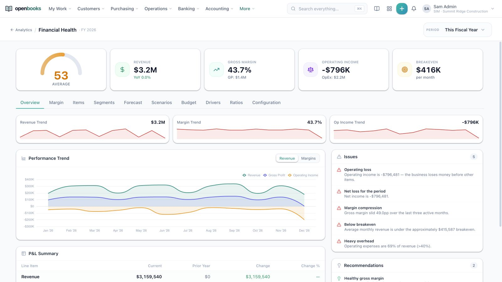
</p>
<p align="center"><sub>Move from headline performance to trends, exceptions, recommendations, and the underlying financial statements in one workspace.</sub></p>

<table>
  <tr>
    <td width="50%">
      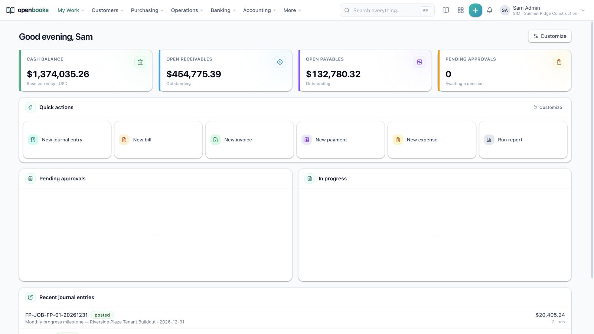<br />
      <sub><strong>Personalized workspace:</strong> Cash, receivables, payables, quick actions, approvals, and recent accounting activity.</sub>
    </td>
    <td width="50%">
      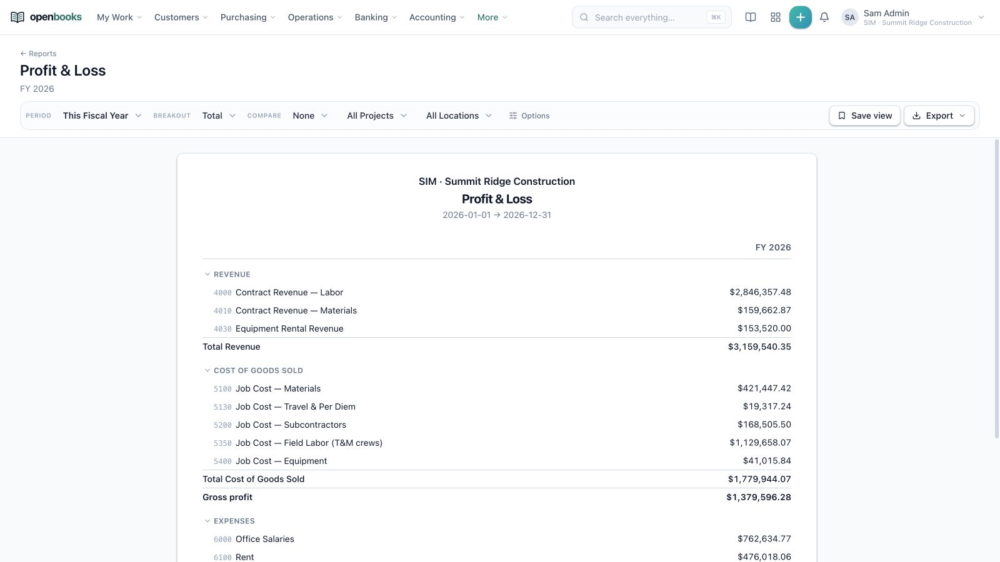<br />
      <sub><strong>Financial reporting:</strong> Drillable statements with dimensions, saved views, comparisons, and exports.</sub>
    </td>
  </tr>
  <tr>
    <td width="50%">
      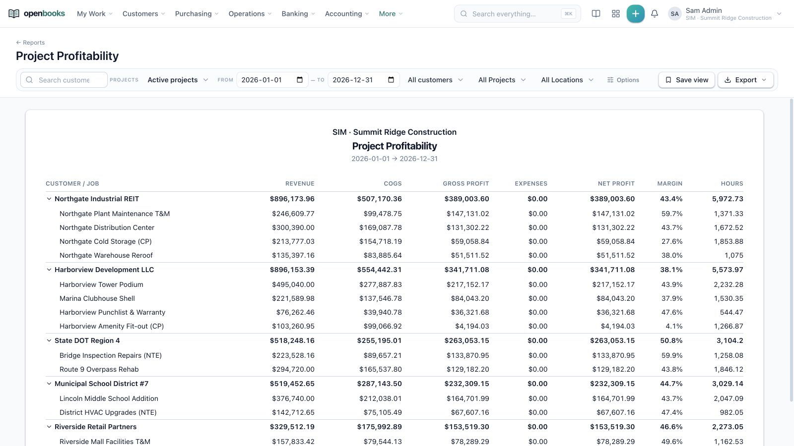<br />
      <sub><strong>Project profitability:</strong> Revenue, cost, margin, profit, and hours from customer down to job.</sub>
    </td>
    <td width="50%">
      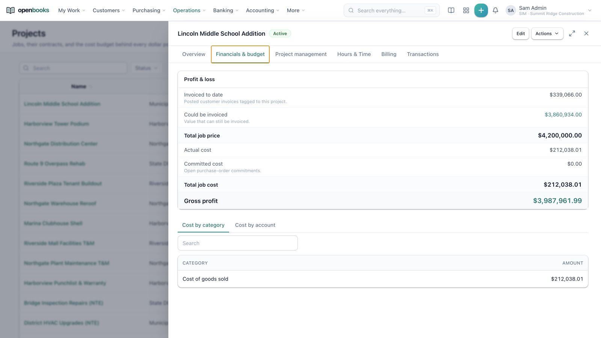<br />
      <sub><strong>Project cockpit:</strong> Contract value, billable balance, actual and committed costs, and gross profit.</sub>
    </td>
  </tr>
  <tr>
    <td width="50%">
      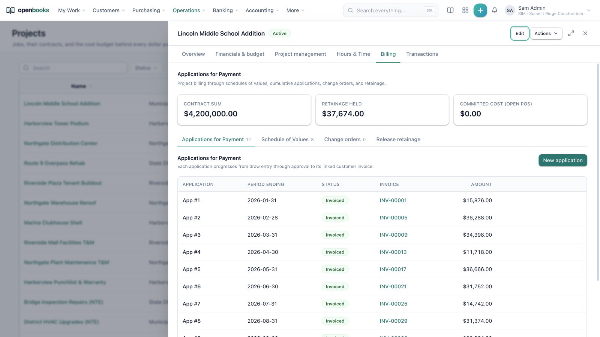<br />
      <sub><strong>Project billing:</strong> Applications, schedules of values, change orders, and retainage stay inside the project record.</sub>
    </td>
    <td width="50%">
      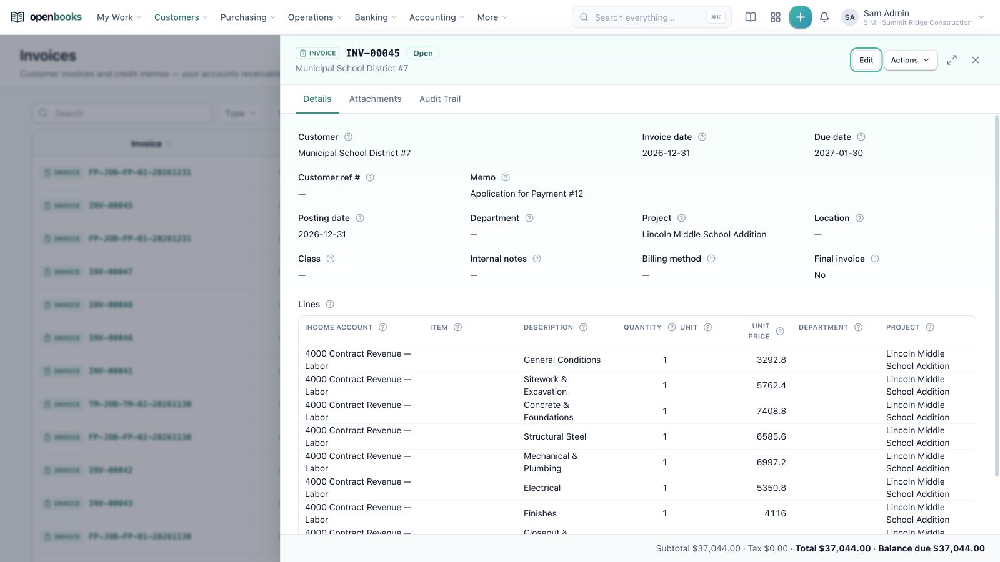<br />
      <sub><strong>Connected invoices:</strong> Approved applications become regular customer invoices with project, line, posting, and audit context.</sub>
    </td>
  </tr>
</table>

<p align="center"><sub>Light mode is shown above. Screenshots use the built-in synthetic Summit Ridge Construction demo; no customer data is shown.</sub></p>

<details>
<summary><strong>Prefer dark mode?</strong> View the same workflows in OpenBooks dark mode.</summary>
<br />
<p align="center">
  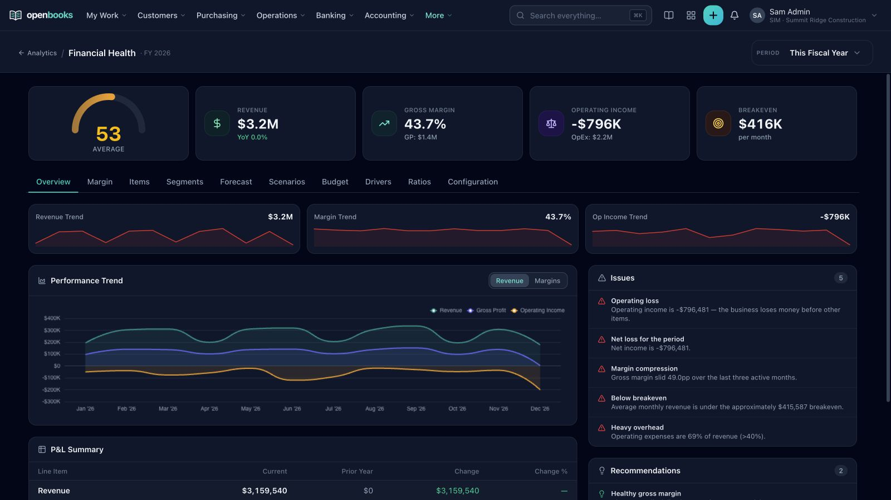
</p>
<table>
  <tr>
    <td width="50%">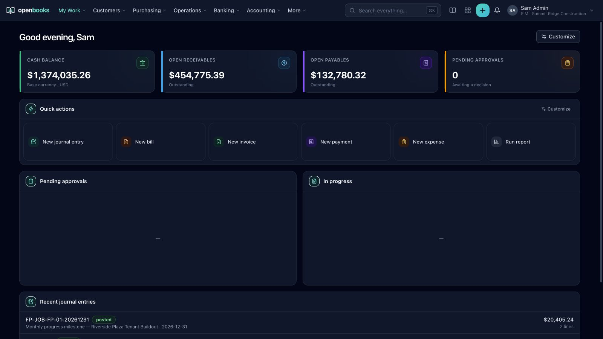</td>
    <td width="50%">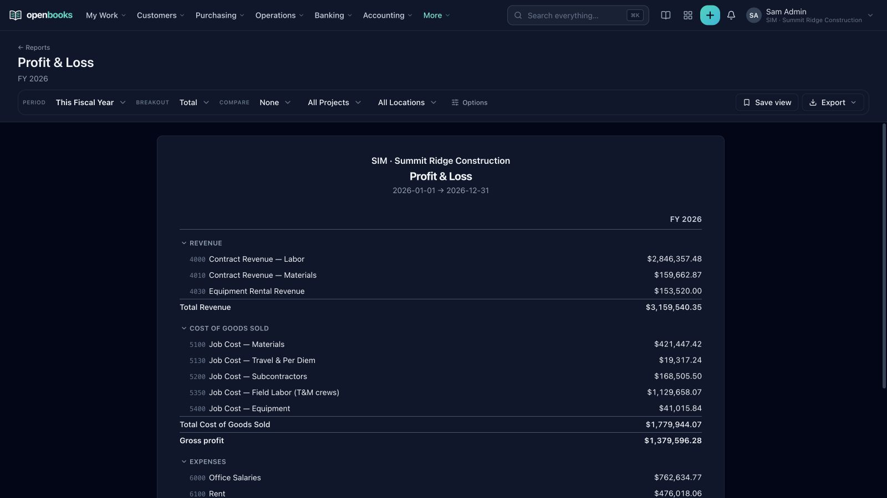</td>
  </tr>
  <tr>
    <td width="50%">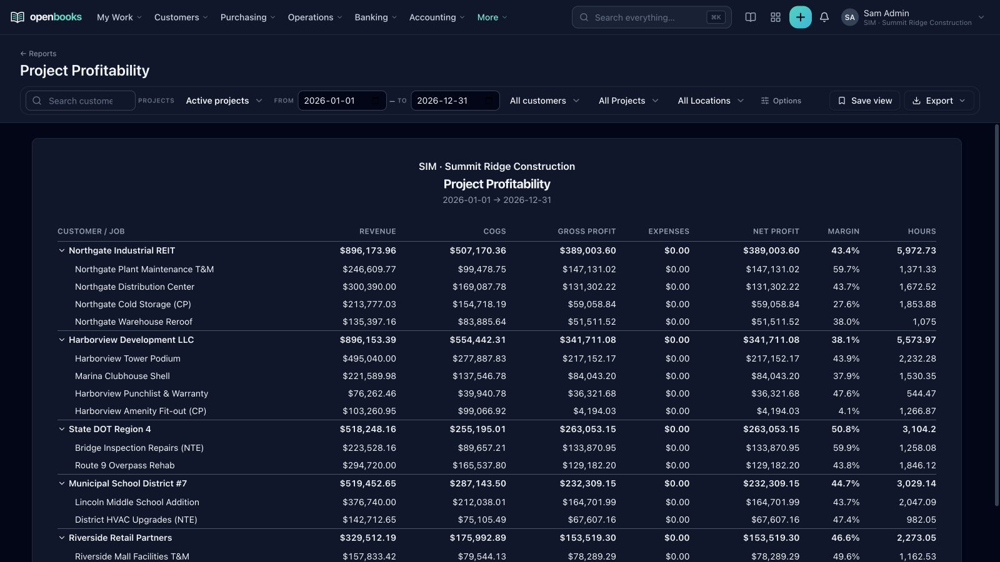</td>
    <td width="50%">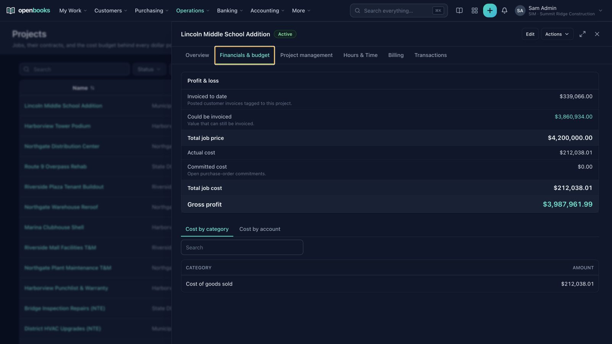</td>
  </tr>
  <tr>
    <td width="50%">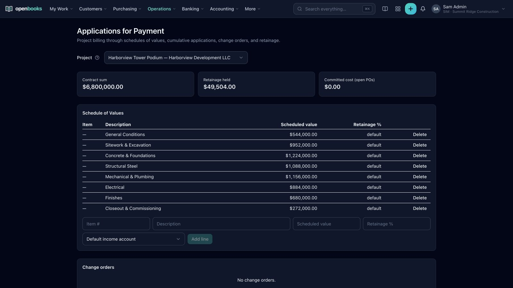</td>
    <td width="50%">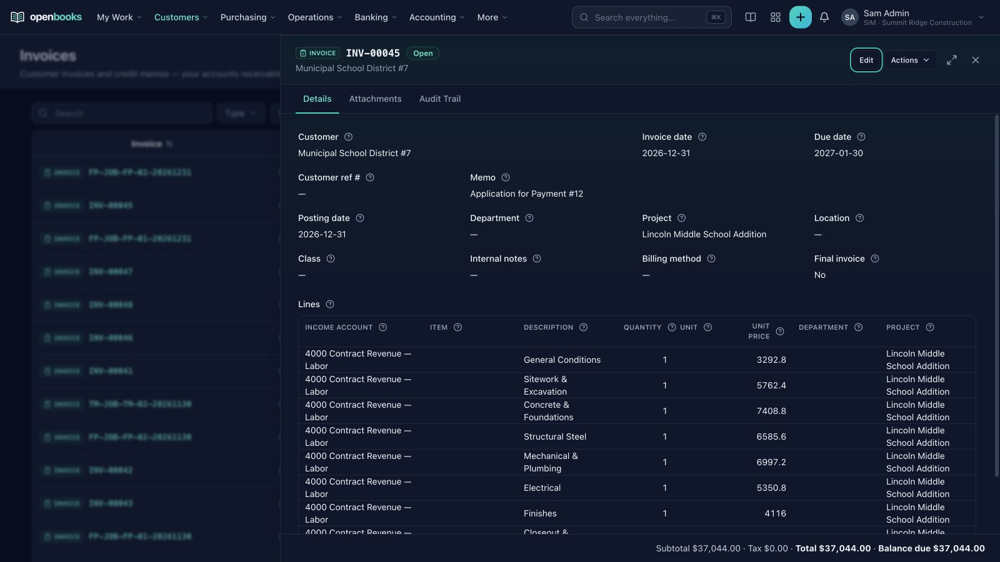</td>
  </tr>
</table>
</details>

### Built for real books, not just easy demos

The feature surface is broad. The accounting foundation is the point:

- PostgreSQL rejects unbalanced journal entries and postings into closed
  periods.
- Financial amounts use `numeric(19,4)` storage and BigInt-based decimal
  arithmetic instead of floating point.
- Organization-owned data is protected by PostgreSQL row-level security as
  well as application authorization.
- Material actions carry explicit lifecycle, permission, concurrency, and audit
  behavior.
- Posting and external-event paths are designed to be idempotent.
- Feature switches preserve data and are enforced at navigation, page, API, and
  service boundaries.
- The schema, REST API, reporting surface, and extension model remain open.

OpenBooks is for project businesses, contractors, professional services firms,
multi-entity groups, and technical finance teams that need more than
entry-level bookkeeping and want lasting control of their software and data.

> [!IMPORTANT]
> OpenBooks is alpha software. Evaluate it with test or parallel books before
> placing production financial records on it. It has extensive automated tests,
> but it has not yet completed an independent accounting audit, security audit,
> or broad production validation.

### Verify the accounting, don't take our word for it

Three things are published, refreshed from CI on every commit to `main`, and
reproducible from a clean checkout:

- **[TRUST.md](TRUST.md)** — every ledger invariant that is checked
  continuously: global balance, per-entry balance, document total against the
  control account, subledger-to-general-ledger tie-out, closed-period
  immutability, and audit-trail immutability. With current results and history.
- **[Standards conformance matrix](docs/trust/conformance-matrix.md)** —
  requirements of ASC 606/IFRS 15, IAS 2/ASC 330, IAS 21, ASC 360/IAS 16, and
  ASC 740/IAS 12 encoded as executable fixtures with exact expected journal
  entries, compared to the hundredth of a cent. Requirements the product does
  **not** implement are published as gaps, never omitted.
- **[AUDIT-CONTROLS.md](AUDIT-CONTROLS.md)** — the control matrix mapped to
  financial-statement assertions (existence, completeness, accuracy, cutoff,
  classification, presentation, rights and obligations) and IT general
  controls, for handing to an audit partner during planning.

```bash
npm -w engine run conformance -- report
```

## Run it

### One-command Docker Compose installation

Requirements: Git and Docker with Docker Compose. The installer pulls the
official alpha release, resolves the tag to its immutable multi-platform
SHA-256 digest, and records that digest before starting any service.

```bash
git clone https://github.com/braedonsaunders/openbooks.git &&
cd openbooks &&
./scripts/compose-up.sh
```

The installer asks for the organization's ISO country and base-currency codes,
then:

1. creates `.env.compose` with separate random database-owner and constrained
   application-role passwords, plus Redis, object-storage, session, encryption,
   internal-service, and administrator credentials;
2. resolves and records the official `0.1.0-alpha.4` image digest in
   `.env.compose`, then pulls that exact image;
3. starts PostgreSQL 16, Redis 7, MinIO, the OpenBooks web application, and its
   background worker;
4. runs migrations and grants in a one-shot privileged bootstrap container,
   then starts web and worker containers that receive only a non-superuser,
   non-`BYPASSRLS` database login; and
5. waits for the application to become healthy before printing the URL and
   first administrator login.

For an unattended first install, provide the choices explicitly:

```bash
ORG_COUNTRY=US ORG_CURRENCY=USD ./scripts/compose-up.sh
```

Open <http://localhost:4780>. Credentials remain in `.env.compose`, which is
created with mode `600` and ignored by Git.

At the first administrator sign-in, OpenBooks opens a guided company setup for
identity, fiscal calendar, industry chart of accounts, and authoritative feature
switches. Setup can be deferred without being recorded as complete and resumed
from **Company Settings → Setup wizard**; completion and deferral are audited.

Useful operations:

```bash
# Status and health
docker compose --env-file .env.compose ps
curl http://localhost:4780/api/v1/health?include=worker

# Follow application logs
docker compose --env-file .env.compose logs -f web worker

# Pull a reviewed release digest and apply any future migrations
OPENBOOKS_IMAGE='ghcr.io/braedonsaunders/openbooks@sha256:<64-lowercase-hex>' \
  ./scripts/compose-up.sh

# Stop without deleting data
docker compose --env-file .env.compose down
```

PostgreSQL, Redis, and MinIO data live in named Docker volumes. `docker compose
down -v` permanently deletes those volumes and must not be used unless data
destruction is intended.

For internet exposure, configure TLS, backups, monitoring, email, secret
management, retention, and network policy appropriate to your environment. See
[SECURITY.md](SECURITY.md), the [backup and restore
runbook](docs/operations/backup-restore.md), and the [upgrade
runbook](docs/operations/upgrades.md). The included Compose deployment remains
one host; the [`deploy/ha`](deploy/ha) reference shows a replicated application
tier backed by separately operated HA PostgreSQL, Redis, and object storage.

## What is implemented

The following capabilities are backed by application routes, services, schema,
migrations, and tests in this repository. Some are optional organization
features and remain disabled until an administrator enables them at **Company
Settings → Features**.

### General ledger, controls, and close

- Chart of accounts, account hierarchy, departments, projects, subsidiaries,
  books, currencies, and other accounting dimensions
- Journal entries and source-document posting
- Open-item subledgers and atomic payment application
- Monthly accounting periods plus AR, AP, and GL module-close sequencing
- Controlled reopen, reversal, void, and correction workflows
- Budgets, scenarios, budget-to-actual analysis, and variance controls
- Continuous-close findings and configurable accounting/finance detectors
- Append-oriented audit evidence for transactions and material configuration
- Income-tax provision calculations and posting support

### Receivables, sales, and revenue

- Customers, prospects, leads, opportunities, activities, forecasts, and CRM
  lifecycle
- Estimates, sales orders, customer invoices, receipts, collections, and
  payment application
- Items, dated prices, taxes, discounts, and document-level approvals
- Revenue contracts, performance obligations, recognition schedules, point-in-
  time and over-time recognition, catch-up entries, and cancellation handling
- Optional subscriptions, recurring invoicing, dunning, hosted payment links,
  payment-provider webhooks, and PSP settlement accounting

### Payables, purchasing, and spend

- Vendors, purchase orders, vendor bills, payment runs, payments, and employee
  expense reports
- Canadian CPA-005 EFT file generation
- AP document capture with optional OCR adapters and purchase-order matching
- Approval policies, amount routing, worklists, quorum, delegation, escalation,
  and prevention of self-approval
- Vendor compliance classes, certificates and evidence, lien waivers, payment
  release controls, and 1099/T4A information-return workpapers

### Banking and cash

- Bank and cash accounts
- OFX and CSV statement import with duplicate detection
- Reconciliation rules, automatic matching, manual matching, adjustments, and
  zero-difference sign-off
- Reconciliation immutability after sign-off
- Optional SFTP statement ingestion and configurable live-feed connections
- Payment-service-provider settlement, fee, refund, and FX reconciliation

### Projects and construction

- Project types and feature profiles
- Project dimensions, job costing, budgets, profitability, and project
  financial drill-down
- Employee time, approval, labor cost evidence, labor pricing, overtime, and
  billable time
- Work breakdown structures, working calendars, baselines, critical-path/Gantt
  scheduling, and optimistic concurrency
- Schedule-of-values billing, progress billing, stored materials, applications
  for payment, retainage, and overbilling controls
- Change orders and project billing requests
- Field tickets with approval/signature workflows and immutable billing lineage
- Equipment usage charges, overhead costing, subcontractor compliance, and lien
  waivers
- Percentage-complete revenue recognition

### Inventory, fixed assets, and equipment

- Inventory receipts, issues, transfers, returns, warehouses, lots, batches,
  serial tracking, and stock availability controls
- FIFO, moving-average, and standard-cost valuation
- Purchase-price variance, landed-cost allocation, COGS, and inventory-to-GL
  reconciliation
- Concurrency controls that prevent overselling
- Fixed-asset registers, categories, alternate depreciation books, and tax
  pools
- Straight-line, declining-balance, double-declining,
  sum-of-years-digits, units-of-production, and custom-formula depreciation
- Remeasurement, impairment, disposal, proceeds, gain/loss, reversal, and
  correction evidence

### Multi-entity and multi-currency

- Legal entities/subsidiaries with organization-level isolation
- Multiple accounting books and entity currencies
- Intercompany configuration and eliminations
- Foreign-currency transactions, exact exchange-rate evidence, realized and
  unrealized gain/loss, and period revaluation
- Ownership interests, ownership-based consolidation, non-controlling-interest
  and goodwill configuration
- Consolidated financial reporting across entities and currencies

### Tax and statutory workpapers

- Effective-dated tax codes and rates
- Sales-tax nexus monitoring
- Tax filings, return boxes, mappings, adjustments, review states, exports, and
  filing evidence
- A 24-pack return-workpaper library covering examples for Canada, the United
  States, the United Kingdom, Australia, New Zealand, several EU countries,
  India, Singapore, South Africa, the UAE, and Japan
- Official-PDF field mapping where a compatible AcroForm is supplied

Tax packs are configurable calculation and preparation workpapers. They are not
a promise of direct electronic filing, government approval, or complete local
statutory compliance in every jurisdiction.

### Payroll

Off by default behind the optional `payroll` feature.

- Versioned statutory engines with penny-exact conformance corpora: CRA T4127
  for Canada (income tax, CPP, CPP2, EI, QPIP, claim codes, bonus method) and
  IRS Publication 15-T for the United States (federal withholding, Social
  Security, Medicare and Additional Medicare, FUTA, SUTA)
- Statutory amounts are engine-computed and never user-authored formulas; each
  country pack declares whether a levy is assessed on earnings or on taxable
  income, so a recalculation cannot silently restate one that should not move
- A five-step pay run — scope, readiness, review, GL preview, post — with
  regular, off-cycle bonus, and final-pay run types, a test calculation that
  computes and rolls back, a staleness gate that refuses to commit figures an
  input has moved past, and a per-employee diff against the previous stub
- Entitlement plans on one append-only ledger: banked time, vacation banks, and
  benefit recoup, with effective-dated caps scoped by employee, job title,
  trade, department or entity, service-based tiers, and a GL liability account
  per plan so a bank is on the balance sheet
- Declarative derived-earnings rules that turn operational facts into
  job-costed pay — per diem, on-call, travel costed to the first job of the
  day, site incentives with title inclusion and exclusion — each with a preview
  of who it pays before it is enabled
- Deduction protection: disposable-earnings caps with a configurable base and
  priority ordering across competing orders, reporting any shortfall rather
  than discarding it, plus per-period and annual basis caps in hours or dollars
- Union agreements, classifications, per-hour and percent fringes, and dues
- Employer levies: workers' compensation, and health levies resolved per region
  rather than per employer, all job-costed
- Statutory rates the employer supplies — experience-rated unemployment,
  per-state credit reductions, provincial health levies — held per filing
  account or per region and per tax year, so a two-account employer in one
  state carries the two rates the agency actually assigned it
- Packs declare which tax years they are transcribed for, so an unloaded year
  is a named blocker before a run is built rather than an exception thrown from
  inside a calculation, and a scaffold script generates the next edition as a
  refusing draft until its figures are filled in
- Pay schedules derive every period boundary from their anchor, semi-monthly
  included; an anchor that names no coherent calendar is refused at save
- Pay rails per employee: direct deposit or cheque, with cheque printing and
  numbering, and a funding view that splits the payday between the two
- Multiple statutory filing accounts per tenant (several payroll program
  accounts, or several EINs and state unemployment accounts)
- Mid-year adoption in three dimensions: statutory year-to-date, per-component
  year-to-date so annual contribution ceilings do not restart on the adoption
  date, and entitlement bank carry-ins — each on screen, importable, and locked
  once a run has read it
- A parallel-run reconciliation against the payroll system being replaced:
  import their register, compare every employee and every component to the
  penny, and read the result as a report. Tolerance is zero unless configured,
  and an empty or non-overlapping population reports "nothing was compared"
  rather than a clean result
- Year-end and separation artifacts: T4 and T4 Summary with CRA XML, ROE data
  with ROE Web XML, W-2 and Form 941 extracts
- Remittance runs that raise vendor bills for withheld and accrued amounts
- Paystub PDFs with optional password protection, per-employee print or email
  delivery, and payroll register, payroll journal, entitlement balance, and
  service-milestone reports through the standard report engine

Payroll is country-agnostic: the generic layer branches on nothing, and every
jurisdiction fact — rates, calendars, filings, holiday-pay formulas, which
levies exist and what they are assessed on — is a country-pack declaration.
Canada and the United States are two packs, not a default and an exception.

Specific limits worth knowing before you rely on it. US state income-tax
withholding is computed for the nine states that levy none plus California,
New York (including NYC and Yonkers), Pennsylvania (including Philadelphia),
Illinois, New Jersey, Ohio, Michigan (including Detroit), Massachusetts,
Georgia, and North Carolina. Any other state is refused loudly rather than
approximated. Statutory holiday pay is calculated only for jurisdictions whose
formula is transcribed; the rest are refused by name when a holiday falls in
the period. Remittance due dates are computed only for regular remitters and
left unset for accelerated and quarterly schedules rather than guessed.
Quebec's RL-1 electronic filing is out of scope pending the gated
specification, so Quebec year-end refuses rather than filing something wrong.

### Reporting, automation, and extension

- Trial balance, profit and loss, balance sheet, cash flow, general ledger,
  aging, position, project, inventory, asset, tax, and operational reports
- Drill-through from financial statements to registers and source transactions
- Custom report definitions, saved views, schedules, PDF, Excel, and CSV
  output
- Analytics dashboards, chart/card insights, saved searches, and a read-only
  PostgreSQL workbench
- PDFKit financial-report output plus a Chromium renderer for HTML-authored
  reports, forms, and templates
- Custom fields, custom record types, configurable forms, PDF templates, and
  customizable navigation
- Audited first-run company setup with industry chart-of-accounts presets,
  feature dependencies, deferral, and an explicit resume path
- Real JavaScript in a QuickJS sandbox
- Visual flows with triggers, conditions, gates, approvals, actions, schedules,
  locks, and run history
- Installable OpenBooks app bundles with manifest validation, content security
  policy, isolated bridge calls, and permission-aware record APIs
- API keys, REST endpoints, generated OpenAPI documentation, file cabinet,
  stored backups, sandboxes, clone/masking support, and change sets
- Optional AI assistant with administrator-configured providers and
  confirmation-gated write proposals

### Migration tooling

Source connectors and migration services exist for:

- NetSuite
- QuickBooks Online
- QuickBooks Desktop Web Connector
- Xero
- ERPNext
- Odoo
- Microsoft Dynamics

Connector coverage differs by source and record type. Treat migrations as
controlled projects: use an isolated target, review exceptions, reconcile
subledgers and statements, and retain signed migration evidence before cutover.

### Languages

The interface includes locale catalogs for:

- English
- French
- Spanish
- German
- Brazilian Portuguese
- Chinese
- Japanese

## What OpenBooks does not currently claim to be

OpenBooks does not currently include a complete:

- complete 50-state US income-tax withholding (federal withholding, FICA, FUTA
  and SUTA ship in the payroll feature alongside the CRA T4127 engine; state
  withholding currently covers the nine no-tax states plus AL, AR, AZ, CA, CO,
  CT, DE, GA, IL, IN, IA, KY, MA, MD, ME, MI, MN, NJ, NY, NC, OH, OR, PA, RI,
  SC, UT, VA, VT, WV and WI — every other state is refused rather than estimated);
- human-capital-management suite — payroll pays people, but there is no
  applicant tracking, onboarding, performance, benefits-administration or
  employee self-service;
- full manufacturing/MRP and production-order suite beyond the light
  bill-of-materials assembly-build workflow;
- point-of-sale or e-commerce storefront;
- native iOS or Android application;
- offline-first client; or
- universally certified direct tax/e-invoice filing service.

It also does not yet claim SOC 2, ISO 27001, PCI DSS, government filing
certification, independent penetration testing, or independent accounting
certification.

## Accounting kernel

Documents and journal entries are separate records. Posting projects an
approved source document into exactly one balanced journal entry and records
source lineage.

The database control layer enforces:

- debit/credit balance at the journal-entry boundary;
- valid active posting accounts;
- closed-period restrictions;
- document/application amount caps;
- tenant ownership and foreign-key integrity;
- immutable signed-off reconciliations;
- exactly-once source posting; and
- controlled amendment, reversal, and migration scopes.

Authorized open-period corrections may re-materialize a source document's
journal projection only while dependency and period controls pass. The change
records before/after document and GL evidence. Closed-period corrections use a
controlled reopen or a reversing/adjusting entry according to the applicable
workflow.

Financial calculations use decimal strings and BigInt-scaled units. Currency
amounts are stored at four decimal places; exchange rates retain additional
precision. Request, service, posting, reporting, and display tests guard against
crossing the binary floating-point boundary.

## Security and tenant isolation

OpenBooks combines:

- revocable server-side sessions with signed, production-secure cookies and
  asynchronous, versioned scrypt password hashes (legacy hashes are upgraded
  after a successful credential check); request-path KDF work is capped at four
  active jobs plus a 32-request FIFO queue per web process;
- database-backed login throttling, privacy-preserving failure events, and
  escalating temporary account lockout shared by every web replica;
- first-party TOTP authenticator MFA with one-time recovery codes, plus generic
  OpenID Connect authorization-code SSO with PKCE and asymmetric ID-token
  verification;
- RBAC roles, wildcard permissions, explicit user overrides, and subsidiary
  restrictions;
- PostgreSQL row-level security on organization-owned tables;
- separate migration-owner and application database roles: the privileged
  credential exists only in the one-shot bootstrap container, while both web
  and worker fail startup if their login can bypass RLS or escalate roles;
- scoped and hashed API keys;
- AES-256-GCM protection for stored connection/provider secrets;
- sandbox and app content-security policies;
- audit logs and workflow evidence; and
- server-side feature, permission, state-transition, and concurrency checks.

OpenBooks does not currently implement SAML SSO. See [SECURITY.md](SECURITY.md)
for the support policy, private reporting channel, authentication deployment
details, and operator responsibilities.

### Authentication deployment

Every successful login creates a server-side session record. Users can inspect
and selectively revoke active sessions from **Account → Sign-in security**;
sign-out revokes the current record rather than only deleting its browser
cookie. Session, login-limit, and MFA-challenge state is stored in PostgreSQL,
so it remains effective when several web replicas are deployed.
The stateful session format intentionally invalidates cookies issued by builds
before migration `0129`; users sign in again once after this upgrade. Apply the
migration first, then replace all old web replicas as one coordinated or
blue/green cutover. Do not use a mixed-version rolling deployment for this one
authentication-format transition. Homogeneous replicas are supported afterward.

TOTP MFA is enabled by each user from **Account → Sign-in security**. Setup
requires the current password, is bound to the initiating session, expires after
ten minutes, and is discarded after five incorrect confirmation codes. Enabling
MFA revokes every other active session and produces ten one-time recovery codes.
Recovery codes are shown once and stored only as versioned, per-code salted
hashes; they do not depend on `SESSION_SECRET`. The TOTP secret is encrypted
with `OPENBOOKS_DATA_KEY`.
Replacing recovery codes or disabling MFA requires both the current password
and a current MFA/recovery credential, and failed reauthentication participates
in the same distributed lockout policy as sign-in.

Generic OIDC SSO is enabled when `OPENBOOKS_OIDC_ISSUER`,
`OPENBOOKS_OIDC_CLIENT_ID`, and an HTTPS `OPENBOOKS_APP_URL` are configured.
`OPENBOOKS_OIDC_CLIENT_SECRET` is optional for public PKCE clients, and
`OPENBOOKS_OIDC_LABEL` customizes the login button. Register this redirect URI
with the identity provider:

```text
${OPENBOOKS_APP_URL}/api/auth/oidc/callback
```

OIDC never provisions an OpenBooks user. On first use it links the provider's
stable issuer/subject to exactly one existing, active production user only when
the provider supplies a boolean `email_verified: true` claim. Ambiguous email
matches fail closed. Subsequent sign-ins use the stable subject mapping. Local
TOTP MFA, when enabled for that user, is still required after OIDC.

Per-identity login limiting and a high, coarse deployment-wide password-attempt
ceiling are always active. When saturated, the latter skips dummy password-KDF
work and new state for unknown identifiers but deliberately remains fail-open
for real users, so it cannot become a system-wide lockout. Unknown identifiers
normally receive the same HMAC-only lockout accounting as users; those rows
expire after one quiet hour to bound unique-identifier spray. Set
`OPENBOOKS_TRUST_PROXY=1` only
when a trusted reverse proxy strips incoming forwarding headers and writes its
own `X-Forwarded-For` or `X-Real-IP`; this additionally enables per-network
limits without trusting attacker-supplied addresses. Production session and
authentication cookies are always `Secure`; this cannot be disabled by an
environment override. Production health checks and authentication handling also
reject a missing, short, placeholder, or obviously repetitive `SESSION_SECRET`;
supply at least 32 cryptographically random bytes.

If a web process's bounded KDF queue is full, both known and unknown identities
receive the ordinary delayed invalid-credentials response. Capacity exhaustion
does not increment account lockout state and never reveals whether the supplied
email exists.

Rotating `SESSION_SECRET` deliberately logs out every browser, invalidates any
in-progress OIDC flow, and starts new privacy-hash namespaces for short-lived
login throttling. Stale login-state rows are pruned automatically. Salted MFA
recovery-code hashes are unaffected. Coordinate the new key across all web
replicas in a single cutover. Replacing `OPENBOOKS_DATA_KEY` requires a planned
decrypt-and-re-encrypt migration for stored TOTP and provider secrets; changing
it in place makes existing ciphertext unreadable.

The prerelease canonical baseline includes the complete stateful authentication
catalog; there is no legacy authentication migration in a fresh installation.
Before any future upgrade, take and test a database backup. A deployment can
disable OIDC by removing its optional environment variables, but it must not
delete authentication tables as a rollback: doing so invalidates revocation,
lockout, MFA, and session evidence. Restore the pre-upgrade database backup if a
complete rollback is required.

## Architecture

OpenBooks is an npm-workspaces monorepo:

```text
schema/       Drizzle schema, canonical SQL baseline, future migrations,
              row-level security, and accounting-kernel controls
engine/       Posting, subledgers, money math, close, assets, inventory,
              workflow runtime, workers, migration adapters, and simulation
web/          Next.js App Router application, REST routes, reports, admin,
              documentation, authentication, and organization context
packages/
  ui/             shared design system
  analytics/      insight query engine and visualizations
  reports/        custom-report definitions and scheduling
  pdf/            PDFKit and Chromium-backed document rendering
  office/         Excel and CSV output
  forms-core/     form schema, automation model, and evaluator
  customization/ custom fields and record types
  jobs/           BullMQ queues and worker heartbeat
  emails/         provider-neutral transactional email
```

| Layer | Implementation |
| --- | --- |
| Web | Next.js 16, React 19, Tailwind CSS 4 |
| Language | TypeScript 5.9 and 7.0 workspace toolchains |
| Database | PostgreSQL 16, Drizzle ORM, handwritten control SQL |
| Queues | Redis 7 and BullMQ |
| Object storage | S3-compatible storage; MinIO in the Compose stack |
| Money | `numeric(19,4)` plus BigInt decimal helpers |
| Scripting | QuickJS sandbox |
| Reporting | SQL, custom report AST, PDFKit, Chromium, ExcelJS, CSV |
| Localization | next-intl with seven locale catalogs |
| Authentication | scrypt passwords, signed cookies, RBAC |
| Packaging | Multi-stage Docker image with web, bootstrap, and worker |

The Compose stack runs the production image first as a one-shot bootstrap
service. It takes a database advisory lock, applies tracked migrations and
verifies their immutable digests, refreshes row-level security, verifies the
catalog and constrained runtime role, ensures base roles and periods, and
creates the first administrator only when none exists. The image then runs
separately as web and worker processes with only the constrained application credential; the
database-owner credential is not present in either runtime container.

## Development

```bash
npm ci
cp .env.example .env
# Replace the examples. Bootstrap with a disposable database-owner connection,
# provision a constrained runtime role, then leave OPENBOOKS_DB_URL pointed at
# that runtime role for the development server.
OPENBOOKS_BOOTSTRAP=1 npx tsx scripts/bootstrap.ts
npm run dev -w web
```

The source development server listens on <http://localhost:4780>.

Release verification:

```bash
npm run verify:release
```

The gate type-checks every workspace, runs unit and database-integration tests
when a database is configured, and creates a production build. GitHub Actions
also runs a PostgreSQL-backed integration canary, full integration suite,
coverage, and Playwright browser smoke tests.

The release suite covers ledger, posting, payment, banking, close, tax,
fixed-asset, inventory, project, workflow, reporting, security boundaries, and
customization behavior. The test count is intentionally not frozen here; the
checked-in suite and release workflow are authoritative.

## Project status

`v0.1.0-alpha.4` is the current community preview. It adds the timesheet week
lifecycle with configurable approval routing, and fixes a defect in the NACHA
and SEPA direct-debit writers that let a half-configured originator reach the
bank. It builds on alpha.3's guided company setup and go-live experience,
industry sample companies, governed query tools, 16 maintained country tax
packs, canonical source identities, and a hardened one-command container
installation backed by a clean PostgreSQL baseline.

Good uses today:

- evaluation and accounting workflow review;
- local or isolated self-hosted trials;
- migration rehearsals;
- parallel-book pilots;
- development and contribution; and
- building reproducible accounting test cases.

Before relying on OpenBooks as a system of record, validate configuration,
opening balances, tax treatment, reports, permissions, backup restoration,
upgrade behavior, and jurisdiction-specific requirements with qualified
professionals.

## Community

- [GitHub Discussions](https://github.com/braedonsaunders/openbooks/discussions)
  for questions, ideas, implementation experiences, and design proposals
- [GitHub Issues](https://github.com/braedonsaunders/openbooks/issues) for
  reproducible defects and scoped feature requests
- [CONTRIBUTING.md](CONTRIBUTING.md) for setup, tests, financial integrity
  requirements, and pull-request expectations
- [SECURITY.md](SECURITY.md) for private vulnerability reporting
- [TRUST.md](TRUST.md) for the invariants, the conformance corpus, and how to
  reproduce every published result yourself
- [AUDIT-CONTROLS.md](AUDIT-CONTROLS.md) for the control matrix mapped to audit
  assertions and IT general controls
- [CODE_OF_CONDUCT.md](CODE_OF_CONDUCT.md) for community standards

The most valuable contributions are accounting edge cases, anonymized workflow
descriptions, migration reconciliation cases, translations, deployment testing,
accessibility review, security review, and complete fixes with deterministic
tests.

## License

OpenBooks is licensed under the
**[GNU Affero General Public License v3.0 or later](LICENSE)**.

You may use, inspect, modify, and self-host it. If you provide a modified version
as a network service, the AGPL requires you to offer the corresponding source to
users of that service under the same license.

Copyright © 2026 OpenBooks contributors.

---

<p align="center">
  <a href="https://star-history.com/#braedonsaunders/openbooks&Date">
    
  </a>
</p>

<p align="center">
  <em>The open business suite. Run on open books.</em><br />
  If OpenBooks is useful or interesting, star the repository and join the
  discussion.
</p>
